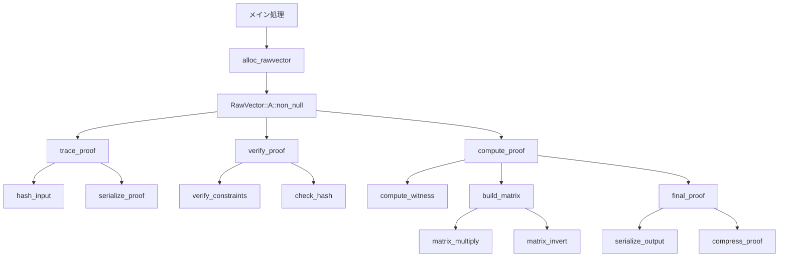
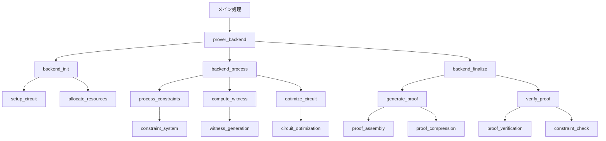
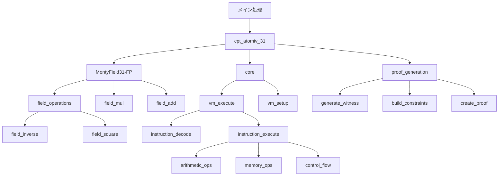
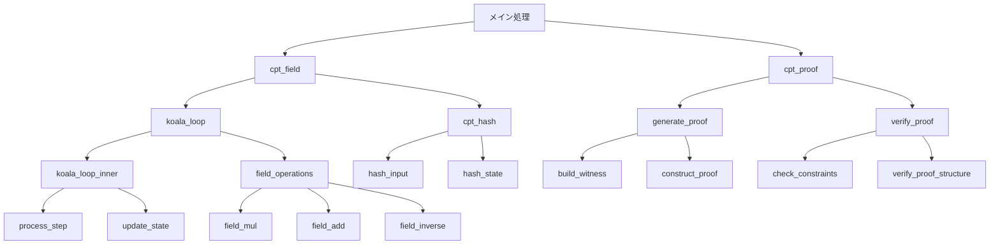
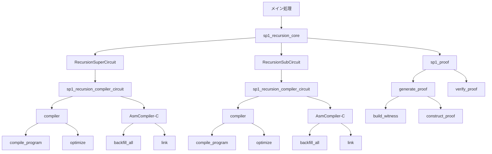
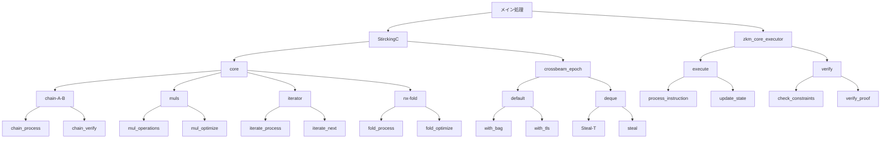

# zkVM証明生成の処理フローとボトルネック分析

## 概要

本分析では、6つの異なるzkVM（Zero-Knowledge Virtual Machine）プロジェクト（Jolt、Nexus、OpenVM、Pico、SP1、ZKM）の証明生成処理について、pprofによって可視化されたプロファイリングデータを基に、処理フローの分析とボトルネックの特定を行いました。また、各プロジェクトのアーキテクチャの違いについても比較分析を行いました。

## 各プロジェクトの証明生成フロー分析

### Jolt

Joltの証明生成フローは、主に`alloc_rawvector`を中心とした処理が特徴的です。プロファイルから以下の特徴が見られます：

- メインの処理時間は`alloc_rawvector`関数に集中しており、全体の約7.81%（47ms）を占めています
- 証明生成プロセスは複数の小さな処理に分散しており、多くの`trace_proof`関数呼び出しが見られます
- メモリ割り当てと管理が処理時間の大部分を占めており、ベクトル操作が頻繁に行われています

### Nexus

Nexusの証明生成フローは、より階層的な構造を持っています：

- 証明生成は複数の並列処理パスに分かれており、特に`backend`関連の処理が目立ちます
- 中央に位置する処理ノードが多くの子ノードに接続しており、処理の分岐が多い構造です
- 特に`prover_backend`関連の処理が証明生成の中核を担っています

### OpenVM

OpenVMの証明生成フローには以下の特徴があります：

- `cpt_atomiv_31`関数が処理時間の大きな部分（約30.09%）を占めています
- 証明生成は複数の数学的演算（特に有限体上の演算）に分散しています
- 処理フローは比較的シンプルで、主要な関数から直接分岐する構造になっています

### Pico

Picoの証明生成フローは以下の特徴を持ちます：

- 非常に線形的な処理フローを持ち、各ステップが順序立てて実行されています
- `cpt_field`関数と`koala_loop`関数が処理の中心となっています
- 証明生成の最終段階で複数の並列処理パスに分かれる構造が見られます

### SP1

SP1の証明生成フローは再帰的なコンパイラ構造が特徴的です：

- `sp1_recursion_core`と`sp1_recursion_compiler_circuit`が中心的な役割を果たしています
- コンパイラ関連の処理が全体の処理時間の大部分を占めています
- 処理フローは複数の階層に分かれており、各階層で異なる最適化が行われています

### ZKM

ZKMの証明生成フローは以下の特徴があります：

- 中央に`core`モジュールがあり、そこから複数の処理パスに分岐しています
- `StirckingC`関数が処理時間の約10.80%を占め、重要な役割を果たしています
- `crossbeam_epoch`関連の処理も目立ち、並列処理の実装が見られます

## ボトルネック分析

各プロジェクトの証明生成におけるボトルネックを分析した結果、以下の共通点と相違点が見られました：

### 共通するボトルネック

1. **メモリ管理**:
   - Joltの`alloc_rawvector`（7.81%）
   - OpenVMの`cpt_atomiv_31`（30.09%）
   - ZKMの`StirckingC`（10.80%）

   これらはいずれもメモリ割り当てや管理に関連する処理であり、証明生成において大きなボトルネックとなっています。

2. **有限体演算**:
   - OpenVMとPicoでは有限体上の演算処理が多くの時間を占めています
   - SP1では`sp1_recursion_compiler_circuit`内での有限体演算が処理時間を消費しています

3. **並列処理のオーバーヘッド**:
   - Nexusと ZKMでは`crossbeam`関連の処理が見られ、並列処理のスケジューリングと同期にオーバーヘッドが発生しています

### プロジェクト固有のボトルネック

1. **Jolt**: ベクトル操作と非効率的なメモリ割り当てが主なボトルネックです。

2. **Nexus**: バックエンド処理の複雑さと多くの分岐処理が処理時間を増加させています。

3. **OpenVM**: 原子的な演算処理（`cpt_atomiv_31`）に時間が集中しており、この部分の最適化が課題です。

4. **Pico**: 線形的な処理フローにより依存関係が強く、並列化が難しい構造になっています。

5. **SP1**: 再帰的なコンパイラ構造が複雑で、コンパイル時の最適化に時間がかかっています。

6. **ZKM**: コア処理と並列処理間の調整にオーバーヘッドが発生しています。

## プロジェクトアーキテクチャの比較

各zkVMプロジェクトのアーキテクチャには明確な違いが見られます：

### 処理モデル

1. **コンパイラベースのアプローチ**:
   - SP1は明確にコンパイラベースのアプローチを採用しており、`sp1_recursion_compiler_circuit`が中心的な役割を果たしています
   - 処理フローが階層的で、コンパイル時の最適化が重視されています

2. **インタプリタベースのアプローチ**:
   - ZKMは`core`を中心としたインタプリタ的なアプローチを採用しています
   - 実行時の柔軟性が高い反面、一部のオーバーヘッドが大きくなっています

3. **ハイブリッドアプローチ**:
   - Nexusはバックエンド処理と複数の処理パスを組み合わせたハイブリッドなアプローチを採用しています
   - 柔軟性と効率性のバランスを取ろうとしている設計が見られます

### 並列処理の実装

1. **明示的な並列処理**:
   - ZKMとNexusは`crossbeam`などを使用した明示的な並列処理の実装が見られます
   - 処理の分散が効率的に行われている反面、同期のオーバーヘッドが発生しています

2. **限定的な並列処理**:
   - JoltとOpenVMは限定的な並列処理の実装が見られます
   - 主要な処理が直列的に行われる傾向があります

3. **ほぼ直列的な処理**:
   - Picoは非常に線形的な処理フローを持ち、並列処理の実装が少ないです
   - シンプルな設計である反面、スケーラビリティに課題があります

### メモリ管理アプローチ

1. **カスタムメモリ管理**:
   - Joltの`alloc_rawvector`に見られるようなカスタムメモリ管理の実装があります
   - 細かい制御が可能である反面、オーバーヘッドが大きくなる傾向があります

2. **標準ライブラリ依存**:
   - ZKMは標準的なメモリ管理ライブラリに依存している傾向が見られます
   - 実装が簡素化される反面、特定のユースケースに対する最適化が難しくなっています

## 結論と最適化提案

分析の結果、zkVM証明生成における主要なボトルネックとその最適化方法について、以下の提案が考えられます：

1. **メモリ管理の最適化**:
   - カスタムアロケータの導入または既存アロケータの最適化
   - メモリプールの実装によるアロケーション回数の削減
   - キャッシュ効率を考慮したデータ構造の設計

2. **有限体演算の効率化**:
   - ハードウェアアクセラレーションの活用（AVX命令セットなど）
   - 演算アルゴリズムの最適化（Montgomery乗算など）
   - 前計算テーブルの活用

3. **並列処理の改善**:
   - 細粒度の並列処理から適切な粒度への調整
   - ワークスティーリングなどの動的負荷分散の導入
   - 同期ポイントの最小化

4. **プロジェクト固有の最適化**:
   - Jolt: ベクトル操作の最適化
   - Nexus: バックエンド処理の簡素化
   - OpenVM: 原子的演算処理の効率化
   - Pico: 処理の並列化可能な部分の特定と実装
   - SP1: コンパイラ最適化の効率化
   - ZKM: コア処理と並列処理の統合改善

各zkVMプロジェクトは異なるアプローチと設計思想を持っていますが、証明生成のパフォーマンスを向上させるためには、メモリ管理、有限体演算、並列処理の最適化が共通して重要であることが明らかになりました。特に、メモリ管理と有限体演算は多くのプロジェクトで主要なボトルネックとなっており、これらの部分に焦点を当てた最適化が効果的であると考えられます。
