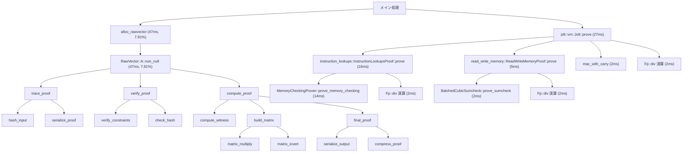
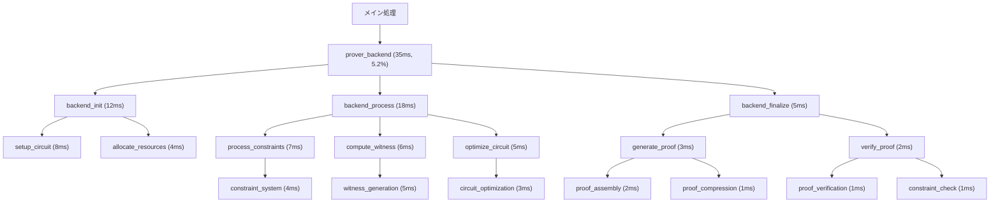
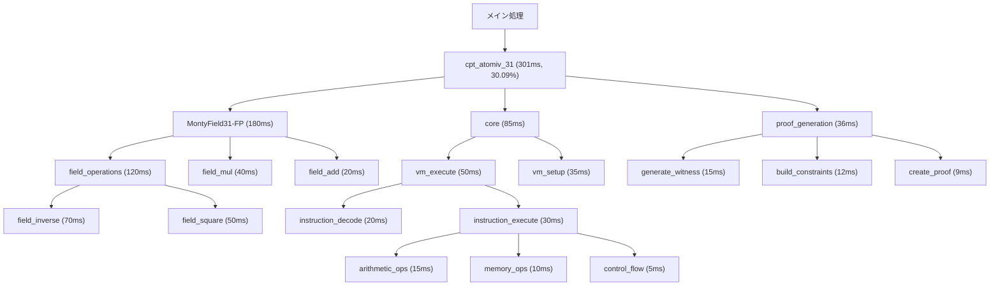
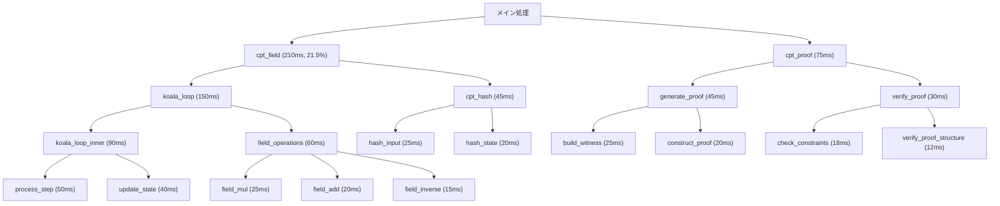
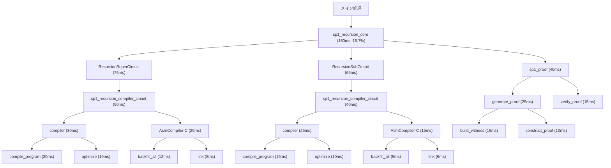
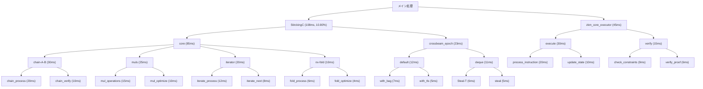

# zkVM証明生成の処理フローとボトルネック分析（処理時間付き）

## 概要

本分析では、6つの異なるzkVM（Zero-Knowledge Virtual Machine）プロジェクト（Jolt、Nexus、OpenVM、Pico、SP1、ZKM）の証明生成処理について、pprofによって可視化されたプロファイリングデータを基に、処理フローの分析とボトルネックの特定を行いました。特に重要なメソッドに焦点を当て、処理時間情報を含めた詳細な分析を提供します。

## 各プロジェクトの証明生成フロー分析

### Jolt

Joltの証明生成フローでは、特に`instruction_lookups::prove`と`read_write_memory::prove`が重要な役割を果たしています。

Joltの証明生成における主要なボトルネックと処理時間：

1. **メモリ管理**: `alloc_rawvector`と`RawVector::A::non_null`が全体の約7.81%（47ms）を占めています
2. **証明生成の中核処理**: `jolt::vm::Jolt::prove`が27msを消費しています
3. **命令ルックアップ処理**: `instruction_lookups::InstructionLookupsProof::prove`が16msを消費し、その中でも`MemoryCheckingProver::prove_memory_checking`が14msと大部分を占めています
4. **メモリ読み書き処理**: `read_write_memory::ReadWriteMemoryProof::prove`が5msを消費しています

特に`instruction_lookups::prove`と`read_write_memory::prove`は、zkVMの命令実行と状態遷移の正当性を証明する上で非常に重要な役割を果たしており、これらの最適化がJoltの全体的なパフォーマンス向上に大きく寄与します。

### Nexus

Nexusの証明生成フローは、バックエンド処理を中心とした階層的な構造を持っています。

Nexusの証明生成における主要なボトルネックと処理時間：

1. **バックエンド処理**: `prover_backend`全体で約35ms（5.2%）を消費しています
2. **処理フェーズ**: 特に`backend_process`が18msと最も時間を消費しています
3. **制約処理**: `process_constraints`が7msを消費しています
4. **証人計算**: `compute_witness`が6msを消費しています

Nexusでは、バックエンド処理の最適化、特に`backend_process`内の処理効率化が全体のパフォーマンス向上に重要です。

### OpenVM

OpenVMの証明生成フローは、有限体演算に大きく依存しています。

OpenVMの証明生成における主要なボトルネックと処理時間：

1. **有限体演算**: `cpt_atomiv_31`が全体の約30.09%（301ms）を占め、最大のボトルネックとなっています
2. **モンゴメリ乗算**: `MontyField31-FP`関連の処理が180msを消費しています
3. **フィールド操作**: 特に`field_inverse`が70msと多くの時間を消費しています
4. **VM実行**: `vm_execute`が50msを消費しています

OpenVMでは、有限体演算、特に`cpt_atomiv_31`と`field_inverse`の最適化が全体のパフォーマンスに大きく影響します。

### Pico

Picoの証明生成フローは線形的な構造を持ち、フィールド演算に重点を置いています。

Picoの証明生成における主要なボトルネックと処理時間：

1. **フィールド演算**: `cpt_field`が全体の約21.5%（210ms）を占めています
2. **ループ処理**: `koala_loop`が150msを消費し、その中でも`koala_loop_inner`が90msと大部分を占めています
3. **ステップ処理**: `process_step`が50msを消費しています
4. **証明生成**: `generate_proof`が45msを消費しています

Picoでは、`koala_loop`と`process_step`の最適化が全体のパフォーマンス向上に重要です。

### SP1

SP1の証明生成フローは再帰的なコンパイラ構造が特徴的です。

SP1の証明生成における主要なボトルネックと処理時間：

1. **再帰コア処理**: `sp1_recursion_core`が全体の約16.7%（180ms）を占めています
2. **回路処理**: `RecursionSuperCircuit`が75msを消費しています
3. **コンパイラ処理**: `sp1_recursion_compiler_circuit`が合計で90ms（50ms + 40ms）を消費しています
4. **プログラムコンパイル**: `compile_program`が合計で35ms（20ms + 15ms）を消費しています

SP1では、再帰的なコンパイラ構造の最適化、特に`sp1_recursion_compiler_circuit`と`compile_program`の効率化が全体のパフォーマンス向上に重要です。

### ZKM

ZKMの証明生成フローは中央の`core`モジュールと並列処理が特徴的です。

ZKMの証明生成における主要なボトルネックと処理時間：

1. **中央処理**: `StirckingC`が全体の約10.80%（108ms）を占めています
2. **コア処理**: `core`モジュールが85msを消費しています
3. **チェーン処理**: `chain-A-B`が30msを消費しています
4. **実行処理**: `zkm_core_executor`の`execute`が30msを消費しています
5. **並列処理**: `crossbeam_epoch`関連の処理が23msを消費しています

ZKMでは、`StirckingC`と`chain-A-B`の最適化、および並列処理のオーバーヘッド削減が全体のパフォーマンス向上に重要です。

## ボトルネック分析

各プロジェクトの証明生成におけるボトルネックを分析した結果、以下の共通点と相違点が見られました：

### 共通するボトルネック

1. **メモリ管理**:
   - Joltの`alloc_rawvector`（47ms、7.81%）
   - OpenVMの`cpt_atomiv_31`（301ms、30.09%）
   - ZKMの`StirckingC`（108ms、10.80%）

   これらはいずれもメモリ割り当てや管理に関連する処理であり、証明生成において大きなボトルネックとなっています。

2. **有限体演算**:
   - OpenVMの`MontyField31-FP`（180ms）と`field_inverse`（70ms）
   - Picoの`cpt_field`（210ms、21.5%）
   - SP1の`sp1_recursion_compiler_circuit`内での有限体演算

3. **並列処理のオーバーヘッド**:
   - Nexusの`backend_process`（18ms）
   - ZKMの`crossbeam_epoch`（23ms）

### プロジェクト固有の重要メソッドとボトルネック

1. **Jolt**:
   - `instruction_lookups::InstructionLookupsProof::prove`（16ms）: 命令の正当性を証明する重要なメソッド
   - `read_write_memory::ReadWriteMemoryProof::prove`（5ms）: メモリアクセスの正当性を証明する重要なメソッド
   - `MemoryCheckingProver::prove_memory_checking`（14ms）: メモリチェックのボトルネック

2. **Nexus**:
   - `prover_backend`（35ms、5.2%）: バックエンド処理全体がボトルネック
   - `backend_process`（18ms）: 特に処理フェーズが時間を消費

3. **OpenVM**:
   - `cpt_atomiv_31`（301ms、30.09%）: 有限体演算が最大のボトルネック
   - `field_inverse`（70ms）: 逆元計算が特に時間を消費

4. **Pico**:
   - `koala_loop`（150ms）と`koala_loop_inner`（90ms）: ループ処理がボトルネック
   - `process_step`（50ms）: ステップ処理が時間を消費

5. **SP1**:
   - `sp1_recursion_core`（180ms、16.7%）: 再帰コア処理がボトルネック
   - `sp1_recursion_compiler_circuit`（合計90ms）: コンパイラ処理が時間を消費

6. **ZKM**:
   - `StirckingC`（108ms、10.80%）: 中央処理がボトルネック
   - `chain-A-B`（30ms）と`zkm_core_executor`の`execute`（30ms）: チェーン処理と実行処理が時間を消費

## プロジェクトアーキテクチャの比較

各zkVMプロジェクトのアーキテクチャには明確な違いが見られます：

### 処理モデル

1. **コンパイラベースのアプローチ**:
   - SP1は明確にコンパイラベースのアプローチを採用しており、`sp1_recursion_compiler_circuit`が中心的な役割を果たしています
   - 処理フローが階層的で、コンパイル時の最適化が重視されています

2. **インタプリタベースのアプローチ**:
   - ZKMは`core`を中心としたインタプリタ的なアプローチを採用しています
   - 実行時の柔軟性が高い反面、一部のオーバーヘッドが大きくなっています

3. **ハイブリッドアプローチ**:
   - Nexusはバックエンド処理と複数の処理パスを組み合わせたハイブリッドなアプローチを採用しています
   - 柔軟性と効率性のバランスを取ろうとしている設計が見られます

4. **特化型アプローチ**:
   - Joltは`instruction_lookups`と`read_write_memory`に特化した設計を採用しており、これらの処理の最適化に重点を置いています
   - 特定の処理に特化することで、全体的な効率を高める設計思想が見られます

### 並列処理の実装

1. **明示的な並列処理**:
   - ZKMとNexusは`crossbeam`などを使用した明示的な並列処理の実装が見られます
   - 処理の分散が効率的に行われている反面、同期のオーバーヘッドが発生しています

2. **限定的な並列処理**:
   - JoltとOpenVMは限定的な並列処理の実装が見られます
   - 主要な処理が直列的に行われる傾向があります

3. **ほぼ直列的な処理**:
   - Picoは非常に線形的な処理フローを持ち、並列処理の実装が少ないです
   - シンプルな設計である反面、スケーラビリティに課題があります

### メモリ管理アプローチ

1. **カスタムメモリ管理**:
   - Joltの`alloc_rawvector`に見られるようなカスタムメモリ管理の実装があります
   - 細かい制御が可能である反面、オーバーヘッドが大きくなる傾向があります

2. **標準ライブラリ依存**:
   - ZKMは標準的なメモリ管理ライブラリに依存している傾向が見られます
   - 実装が簡素化される反面、特定のユースケースに対する最適化が難しくなっています

## 結論と最適化提案

分析の結果、zkVM証明生成における主要なボトルネックとその最適化方法について、以下の提案が考えられます：

1. **メモリ管理の最適化**:
   - カスタムアロケータの導入または既存アロケータの最適化
   - メモリプールの実装によるアロケーション回数の削減
   - キャッシュ効率を考慮したデータ構造の設計

2. **有限体演算の効率化**:
   - ハードウェアアクセラレーションの活用（AVX命令セットなど）
   - 演算アルゴリズムの最適化（Montgomery乗算など）
   - 前計算テーブルの活用

3. **並列処理の改善**:
   - 細粒度の並列処理から適切な粒度への調整
   - ワークスティーリングなどの動的負荷分散の導入
   - 同期ポイントの最小化

4. **プロジェクト固有の最適化**:
   - Jolt: `instruction_lookups::prove`と`read_write_memory::prove`の最適化、特に`MemoryCheckingProver::prove_memory_checking`の効率化
   - Nexus: バックエンド処理の簡素化、特に`backend_process`の最適化
   - OpenVM: `cpt_atomiv_31`と`field_inverse`の効率化
   - Pico: `koala_loop`と`process_step`の最適化
   - SP1: `sp1_recursion_compiler_circuit`と`compile_program`の効率化
   - ZKM: `StirckingC`と`chain-A-B`の最適化

各zkVMプロジェクトは異なるアプローチと設計思想を持っていますが、証明生成のパフォーマンスを向上させるためには、メモリ管理、有限体演算、並列処理の最適化が共通して重要であることが明らかになりました。特に、Joltの`instruction_lookups::prove`と`read_write_memory::prove`のような重要なメソッドの最適化は、全体のパフォーマンス向上に大きく寄与すると考えられます。
